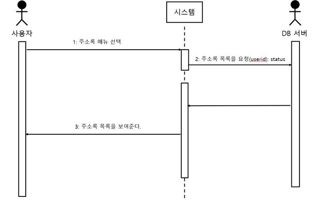

# Webmail System

기존에 구현된 웹 메일 시스템을 유지보수화 과정을 통해 소프트웨어의 생명을 연장시킵니다. 교정 유지보수, 적용 유지보수, 완전화 유지보수, 예방 유지보수를 통해 기능과 수행력을 증진시켜 기존의 웹 메일 시스템의 결함을 제거하여 성능을 향상시히고 사용을 증대시킵니다.

## Program Stacks

- Java
- Apache James Server
- MySQL
- HTML

## Program Design

### 주소록(완전화 유지보수)

### 사용자 관리(완전화 유지보수)

### 비밀번호 보안강화(예방 유지보수)

## Running

